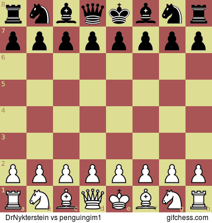

GifLichess
==========

Golang application that converts any lichess game to an animated gif.

- [Live app](https://gifchess.com)
- [Frontend repo](https://github.com/aherve/gifchess-front)

## Table Of Contents
1. [Installation](#installation)
2. [Usage](#usage)

## Installation

### Using Docker (recommended)

- You can either use the precompiled `aherve/giflichess` image, or build an image with `docker build .`

### Build from golang sources

1. Install a golang environment
2. Install inkscape (_e.g._ `sudo apt install inkscape`)
3. Install dependencies with `go get`
4. Compile sources with `go build`
5. Install with `go install -i`

## Usage

### 1. Browse official website

- ~~simply go to [gifchess.com](https://gifchess.com) and profit !~~

### 2. CLI usage

- with docker: `docker run -v $HOME:/app/out aherve/giflichess generate --game BI5pQatH -o /app/out/out.gif` will get game BI5pQatH from lichess, and output `out.gif` to your home
- using go install: `giflichess generate --game BI5pQatH -o out.gif` will get game BI5pQatH from lichess, and output a gif to `out.gif`
- use `giflichess help generate` or `docker run aherve/giflichess help generate` to get a full list of commands and options

### 3. Server usage
- with docker: `docker run -p 8080:8080 aherve/giflichess serve` will start a server on port 8080
- using go install: `giflichess serve ` will start a server on port 8080

- Browse `http://localhost:8080` to see your app
